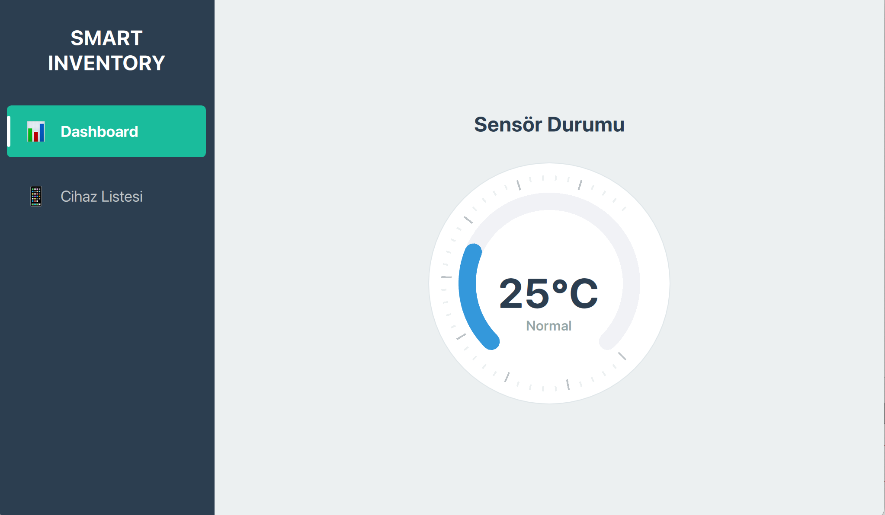
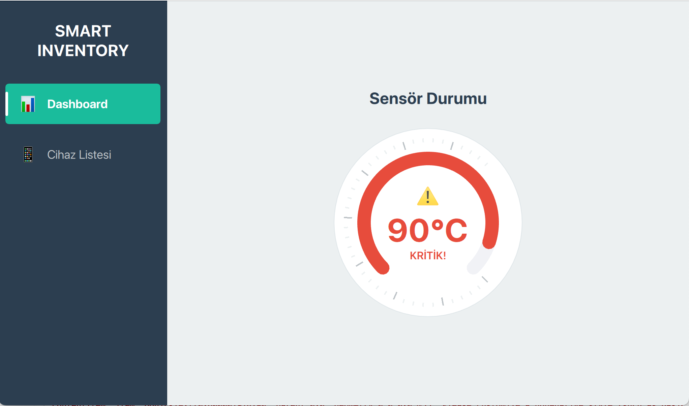
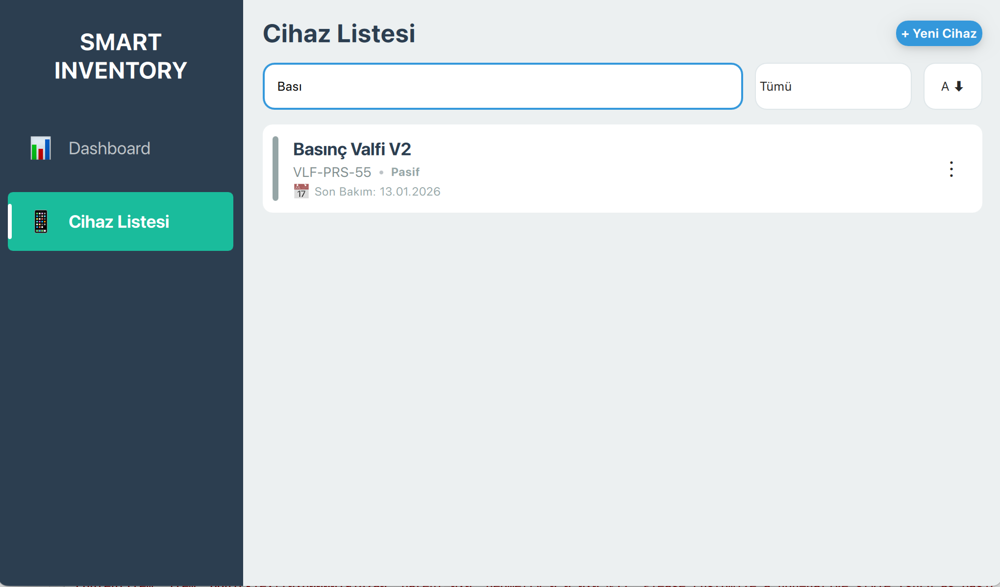
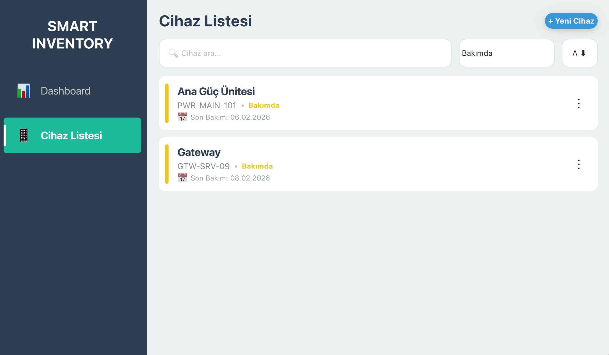
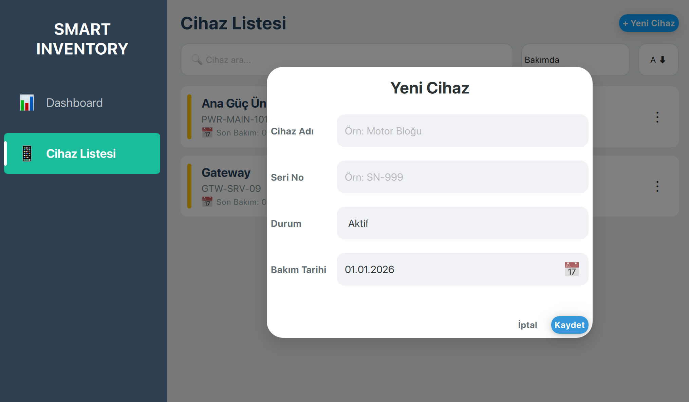
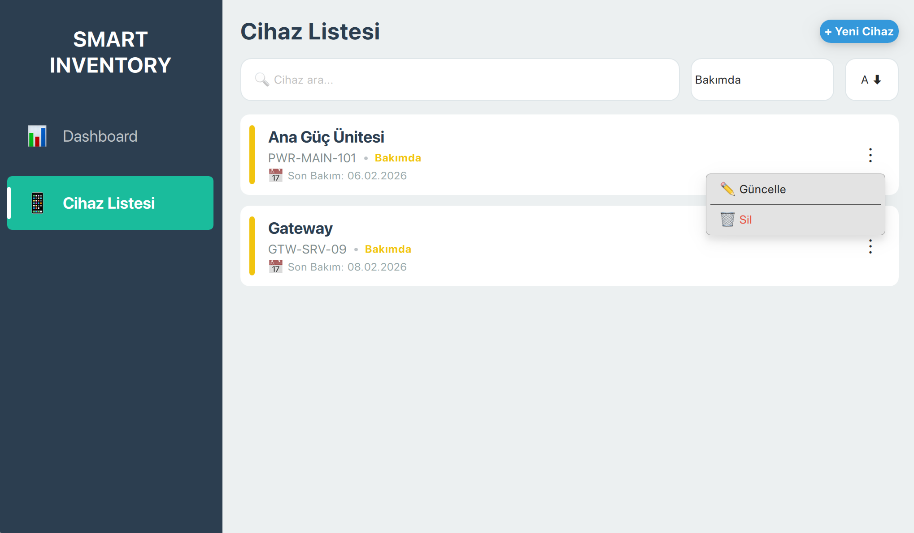

# SmartInventory - Modern IoT Cihaz Yönetim Sistemi


**SmartInventory**, IoT cihazlarını yönetmek ve gerçek zamanlı sensör verilerini izlemek için tasarlanmış, platformlar arası bir masaüstü uygulamasıdır. Modern **Qt Quick (QML)** arayüzü ve güçlü **ASP.NET Core** backend altyapısı ile geliştirilmiştir. Uygulama, **WebSockets** üzerinden gerçek zamanlı veri görselleştirmesi ve modern cam efekti (glassmorphism) içeren kullanıcı dostu bir arayüz sunar.

---

## 📸 Ekran Görüntüleri

### 🔵 Dashboard — Normal Durum

Sensör verileri güvenli aralıkta iken gösterge normal şekilde çalışır.



---

### 🔴 Dashboard — Kritik Durum

Sıcaklık kritik seviyeye ulaştığında (>80°C) arayüz görsel uyarı verir.



---

### 📋 Cihaz Listesi

Sistemde kayıtlı tüm cihazlar liste halinde görüntülenir.


---

### 🔎 Gerçek Zamanlı Arama

Cihazlar isim veya seri numarasına göre anında filtrelenebilir.



---

### 🧩 Filtreleme

Durum veya kriterlere göre cihazlar filtrelenebilir.



---

### ➕ Cihaz Ekleme Penceresi

Modern giriş ekranı ile yeni cihaz ekleme işlemi yapılabilir.



---

### ✏️ Güncelleme & Silme İşlemleri

Cihaz bilgileri güncellenebilir veya sistemden kaldırılabilir.



---

## 🚀 Temel Özellikler

- **Gerçek Zamanlı İzleme:** Sensör verileri SignalR ile canlı aktarılır.
- **Modern UI/UX**
  - Glassmorphism efektleri
  - Akıcı animasyonlar
  - Özel Circular Gauge ve Date Picker bileşenleri
- **CRUD İşlemleri:** Cihaz ekleme, listeleme, güncelleme ve silme.
- **Akıllı Arama & Filtreleme**
- **Platformlar Arası Çalışma:** macOS, Windows, Linux

---

## 🛠️ Kullanılan Teknolojiler

### Frontend (Desktop Client)

- Qt 6 (QML & JavaScript)
- QtWebSockets
- QtQuick Shapes & Effects

### Backend (API Server)

- ASP.NET Core 8 Minimal API
- SignalR Hub
- BackgroundService (IoT veri simülasyonu)
- Entity Framework Core
- SQLite / SQL Server

---

## ⚙️ Kurulum & Çalıştırma

### Gereksinimler

- Qt Creator (Qt 6.x)
- .NET SDK 8.0
- Git

---

### 1. Repoyu Klonlayın

```bash
git clone https://github.com/halilllylmz/SmartInventory.git
cd SmartInventory
```

---

### 2. Backend'i Çalıştırın

```bash
cd SmartInventoryAPI
dotnet run
```

API varsayılan olarak `http://localhost:5113` adresinde çalışacaktır.

---

### 3. Frontend'i Çalıştırın

Qt Creator ile:

- `CMakeLists.txt` veya `.pro` dosyasını açın
- Qt 6 Desktop kit seçin
- Build & Run yapın

---

## 📡 API Endpointleri

| Method | Endpoint          | Açıklama              |
| ------ | ----------------- | --------------------- |
| GET    | /api/devices      | Tüm cihazları getirir |
| POST   | /api/devices      | Yeni cihaz ekler      |
| PUT    | /api/devices/{id} | Cihaz günceller       |
| DELETE | /api/devices/{id} | Cihaz siler           |
| WS     | /sensorHub        | SignalR endpoint      |

---

## 🤝 Katkıda Bulunma

Katkılar memnuniyetle karşılanır:

```bash
git checkout -b feature/AmazingFeature
git commit -m "Add AmazingFeature"
git push origin feature/AmazingFeature
```

Sonrasında Pull Request açabilirsiniz.

---

## 📄 Lisans

MIT License kapsamında sunulmaktadır. Detaylar için LICENSE dosyasına bakabilirsiniz.

---

Developed by Halil Yılmaz
